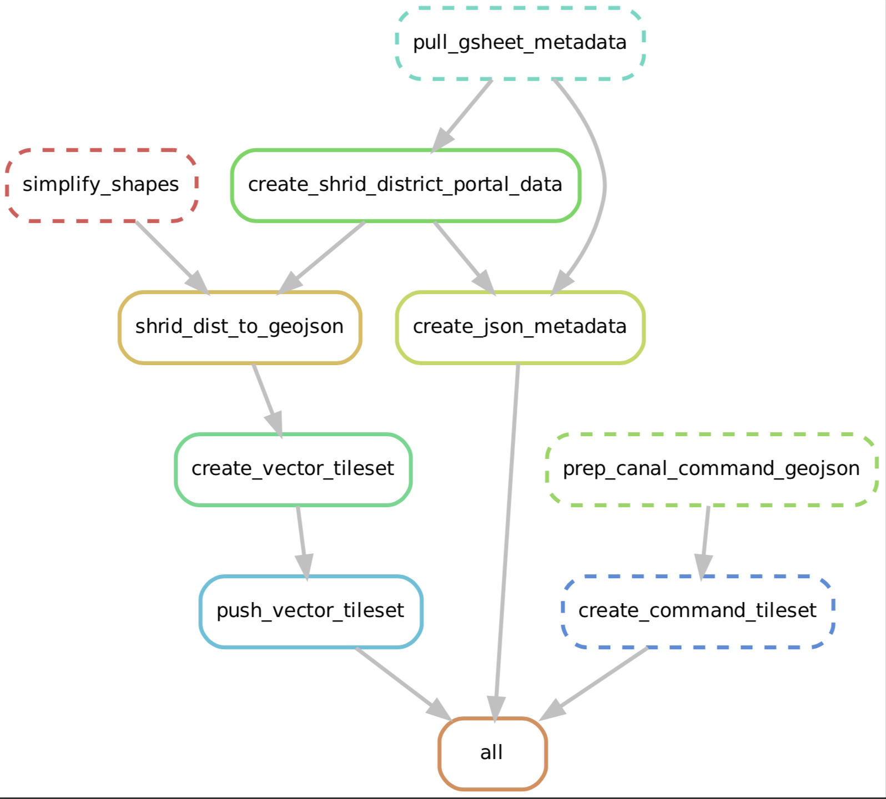

# rural-data-platform
Agriculture and Rural Development Data Platform (ARDDP) source code. The ARDDP was developed with the support of the World Bank.

The [ARDDP platform is available here](http://www.devdatalab.org/rural-data-portal).

Note: this codebase is not intended to be entirely executable or reproducible, rather by open-sourcing we hope to share our methodologies and increase transparency of the approaches taken in the data processing steps for the ARDDP.

